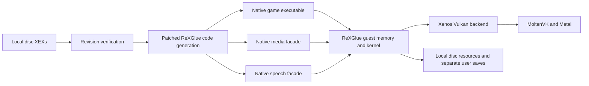

FH1 uses three independently loaded guest images. The primary image occupies
`82000000–83620000`, the media facade `88000000–882B0000`, and the speech facade
`89000000–89240000`. Their entry points are recorded in `config/disc.json`.
The address-specific configuration applies only to the verified disc hashes.

The build converts PPC instructions to C++ ahead of time with
[ReXGlue 0.10.0](https://github.com/rexglue/rexglue-sdk/releases/tag/v0.10.0),
at source revision `c94f5ebdcb3c9d1a460ca48e04f9758448f8d518`. This produces a
native ARM64 host and two facade libraries. The runtime loads XEX data and
resources from the user's disc directory, then registers the corresponding
native code before calling each facade's guest `DllMain`. Guest exports and
indirect calls retain their original addresses.

The main PPC configuration registers missing adjustment thunks and shared
return blocks discovered by inspecting the supplied images. XAPI fiber
functions use ReXGlue's native fiber implementations, since translating a PPC
register save and restore cannot switch the native C++ call stack.

`patches/0001-preserve-xex-heap-allocations.patch` removes the XEX loader's
whole-heap reset. Each image tracks whether it owns an allocation, cleans up
only that allocation after a failed decryption attempt, and releases it on
unload. This preserves other images and dispatch tables in the same heap.
The XEX inspector checks that all three allocations still exist after loading
both facades. The original SDK fails this check; the patched runtime passes.

`patches/0002-trap-unresolved-conditional-branches.patch` removes a silent
return for out-of-function conditional branches. Branches into zero padding
produce an explicit fatal diagnostic matching an illegal guest instruction;
other unresolved conditional branches remain explicit translation failures.
The two zero-padding branches in this disc are retained as faults, rather than
being redirected to a guessed destination. Guest exception delivery for such
faults remains a runtime limitation.

`patches/0003-register-functions-from-mapping-table.patch` registers functions
by looping over the existing mapping table. This keeps the same guest-to-host
mappings while avoiding an enormous generated registration function that
caused Clang's Release optimization to stall.

`patches/0004-resolve-native-module-library-paths.patch` turns generated bare
module names into platform library filenames and resolves relative paths
beside the host executable. macOS requires an actual `lib*.dylib` path when
calling `dlopen`; the original bare name failed native facade loading.
The patch also resolves VFS aliases consistently when matching loaded modules
and registry entries. Previously, unload used a device path to look up a
manifest-relative key and left the facade's native functions registered.

`patches/0005-accept-empty-resolves.patch` treats a resolve clipped to an empty
region as a successful no-op. The Vulkan and D3D12 callers already skip
zero-sized copies. This removes repeated backend failures from FH1's tiled
passes and follows the handling in
[Xenia Canary](https://github.com/xenia-canary/xenia-canary/blob/canary_experimental/src/xenia/gpu/draw_util.cc).

`patches/0006-correct-spirv-texture-exponent-bias.patch` loads the signed result
exponent adjustment from texture-fetch constant word 3, while keeping LOD bias
in word 4. The SDK's Xenos bitfield definition and DXBC translator agree on
these fields. This follows
[Xenia's exponent-bias fix](https://github.com/xenia-project/xenia/commit/32889f51b).
The patched Xenos plugin is built from source and staged beside the executable.

`patches/0007-correct-vector-floating-point.patch` gives vector multiply-add
one rounding, using ARM64 NEON fusion and a fused portable fallback. Negative
multiply-subtract retains the sign of zero by negating after subtraction.
VMX128 dot products accumulate in double precision in guest lane order and
map finite float overflow to canonical QNaN, while retaining infinities and
NaNs from inputs and flushing vector denormals. This follows
[Xenia Canary's dot products](https://github.com/xenia-canary/xenia-canary/blob/canary_experimental/src/xenia/cpu/backend/x64/x64_sequences.cc)
and [Xenia's overflow correction](https://github.com/xenia-project/xenia/pull/1565).
`fh1_vmx_smoke` checks cancellation, signed zero, lane masking, overflow,
non-finite inputs, and denormal behavior. Those checks validate the arithmetic
helpers; collision in FH1 still requires gameplay validation.

`patches/0008-invalidate-codegen-after-tool-changes.patch` includes the codegen
executable's content hash in each module's input fingerprint. The upstream
release-version fingerprint could skip media and speech regeneration after a
local instruction-builder patch, leaving their generated arithmetic stale.
Changing the actual tool now regenerates all affected modules; repeated runs
with the same tool retain the normal cache. If hashing fails, codegen bypasses
the stamp instead of accepting stale output. The project's declared SDK
version remains unchanged.

`patches/0009-reuse-presenter-pipelines.patch` records the swapchain format
when creating a presenter pipeline. The missing assignment made every later
paint treat the cached pipeline as incompatible, wait for its previous use,
destroy it, and compile it again. Pipelines now remain cached until the actual
swapchain format changes. Stack samples after the fix no longer show repeated
presenter pipeline creation during playback.

`patches/0010-back-off-low-priority-guest-polling.patch` implements the Xenon
`cctpl` low-priority hint with a 50-microsecond host sleep. FH1 uses it before
a delay-and-poll sequence in its worker scheduler. The previous no-op
translation removed the delay and consumed a core polling for work. The new
backoff leaves guest registers and the surrounding scheduling logic intact.
Only generated files using this helper include the host threading header.
This changes host scheduling latency and needs extended gameplay validation.
It does not replace the media facade's WMV software decoder.

The FH1 host also enables the existing `gpu_allow_invalid_fetch_constants`
compatibility option after the GPU plugin registers its flags. Explicit user
settings override this default. The graphics issues and this option were
identified during review of
[ItsNotPaths' FH1 findings](https://github.com/ItsNotPaths/fh1-recomp-findings)
and checked against the pinned SDK. Other reported fixes are not assumed to
apply to this SDK revision or ARM64 target.

Generated sources, decrypted images, logs, saves, and SDK downloads are private
local build artifacts. The public project contains configuration, tooling,
runtime patches, and documentation. A native compiled game binary also embeds
translated game code and must be treated as a private artifact.
