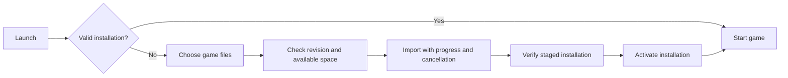

The first-launch installer will be added after macOS world loading and basic
gameplay are reliable. It will import the user's extracted disc, verify the
supported revision, and prepare writable data paths before launching the game.
It is planned for both desktop and mobile; it is not implemented yet.

The first launch presents the ForzaRecomp logo, a short explanation of the
required files, and a Choose Game Files button. The user selects an extracted
disc folder. The installer reports useful progress, verifies the three XEX
hashes against `config/disc.json`, and shows a clear error for missing files or
an unsupported revision. Required resource paths will be recorded as gameplay
validation establishes them. The current executable-hash check alone does not
prove that the complete disc data is present.

The installation service will be independent of its UI. It owns validation,
copy progress, cancellation, and a small versioned installation record. Files
are staged in a temporary directory on the destination volume; the finished
directory is activated only after validation. An interrupted import leaves the
previous installation usable. Imported disc data stays separate from saves,
title cache, settings, and shader cache. Replacing an installation preserves
user data. Subsequent launches use the installation record and detect missing
or changed executable images before entering the runtime.

On macOS, use a native folder picker. A copied installation is the initial
default; a later option can use an external directory with a persistent
security-scoped bookmark. On iOS, use the Files document picker, hold
security-scoped access during import, and copy into the app's private storage.
Releasing access must not leave the game dependent on the original provider.
Storage estimates include temporary staging space, and imports run off the UI
thread. Folder import comes first; archive formats can be added later with
path-traversal and symlink checks, rather than silently treating an ISO as an
extracted folder.

The installer prepares game data for code already compiled into the app.
Today's development build performs PPC-to-C++ generation and native compilation
on macOS. A mobile data-import widget does not perform that compilation or
sign new executable code on the device. An iOS app will require a validated,
signed build containing the main and two facade implementations described in
[ios-port.md](ios-port.md). Such locally generated binaries stay private under
the current repository policy; public source, dependency forks, and installer
code remain independent of game files.

Before release, validate fresh installation, wrong revision, partial disc,
insufficient space, cancellation, interrupted copy, restart, repair, external
provider removal, and preservation of existing saves. Platform UI tests follow
the shared installation-service tests once the service exists.
