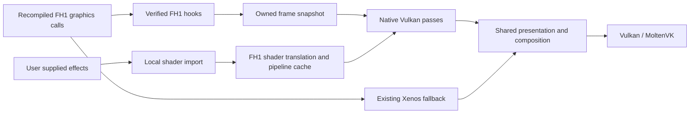

# FH1 native Vulkan renderer

The chosen direction is a title-specific Vulkan renderer, using MoltenVK on
macOS and eventually iOS, and native Vulkan on Windows and Linux. The existing
Xenos renderer remains the working fallback. This document describes the
architecture and the implemented import, translation-probe and discovery
stage. The host shader adapter compiles a tested subset to SPIR-V. Native FH1
drawing, a complete runtime shader cache, renderer switching and a performance
gain are not yet implemented or demonstrated.

## Why Vulkan can still deliver the gain

Skate 3's native renderer uses Vulkan through MoltenVK on macOS. Its author
reports roughly 25 to 250 FPS at 4K for the native renderer in the
[v2.0.0 release notes](https://github.com/mchughalex/skate3recomp/releases/tag/v2.0.0).
That is evidence that MoltenVK need not prevent a large gain; it is not an FH1
benchmark. The useful change is the level where rendering begins: capture the
title's graphics work before Xbox command generation and EDRAM emulation, then
submit it through a host renderer.

The inspected projects offer two approaches:

| Reference | Approach | Useful for FH1 |
| --- | --- | --- |
| [Skate 3 native hooks](https://github.com/mchughalex/skate3recomp/blob/f6e0ae87fdfecbadb5c1e36c55d66a744187a3cd/src/skate3_native_render.cpp) | Capture scene submissions, camera state, geometry and material constants into host draw lists | Eventually skip guest packet construction for covered scene passes; own streamed resources and per-draw transforms |
| [Unleashed graphics bridge](https://github.com/hedge-dev/UnleashedRecomp/blob/cf829a9eca8fb680fba4b0409ddeb6ca92f22e3c/UnleashedRecomp/gpu/video.cpp) | Replace title graphics-device/resource/draw calls and submit through its host graphics abstraction | An earlier entry point that preserves the title's original camera, animation and material setup while removing GPU emulation |
| [XenosRecomp](https://github.com/hedge-dev/XenosRecomp/tree/990d03b28a27b50277ee5d8d942e1c5f873869d1) | Translate complete Xbox shader containers to HLSL and compile host shader caches | Import the supplied game's effects and prepare shaders/pipelines during asset loading rather than during a frame |

Start with device-level observation and replacement; move higher into FH1 scene
submission once the object layouts and pass ownership are verified. A direct
Metal-only implementation would give up the shared backend without removing
the need to reconstruct these title-specific responsibilities.

The current loaded-scene CPU profile attributes 7.2% of sampled CPU work to the
GPU command thread and 27.9% to guest yielding. These are CPU sample shares,
not GPU time or frame-time bounds. The combined GPU recording has only about
half a second of useful execution data. A renderer rewrite therefore needs
its own controlled comparison; see [profiling.md](profiling.md).

## Implemented first stage

`scripts/import_fh1_shaders.py` is an original bounds-checked FXLite reader. It
reads the effect's technique/declaration table, all declaration/stride groups,
optional vertex element names, and embedded standard Xbox shader containers.
It retains packed vertex formats, endianness, swizzles and usage indices, plus
constant names, register banks and sampler bindings. Empty declarations and
effects without element names are valid. Malformed offsets, sizes, counts and
partial name sections fail the import.
Program metadata includes vertex-fetch input semantics, interpolators and
pixel output masks so the adapter can define its own input layout.

Validation against the local disc on 2026-10-05:

| Item | Count |
| --- | ---: |
| Effect objects | 174 |
| Technique-to-declaration entries | 1,496 |
| Vertex declarations | 207 |
| Shader container occurrences | 2,921 |
| Unique containers and unique microcode programs | 2,918 each |
| Vertex / pixel occurrences | 1,514 / 1,407 |
| Effect objects with no shader containers | 0 |

The collection includes 153 car effects, 17 driver-hand effects, one track
bank and three particle effects. Containers can be extracted unchanged for a
shader translator. This is a structural inventory: FXLite's internal
technique-to-program pass relationships are still opaque, and extraction does
not establish native shader correctness.

```sh
python3 scripts/import_fh1_shaders.py --extract \
  --output out/native-renderer/shaders
python3 tools/map_graphics_hooks.py \
  --output out/native-renderer/hooks
```

Each output must be a new directory beneath this project's ignored `out/`;
choose another name for a repeat run. Input files are never modified. The
shader manifest contains private material names, bindings and program hashes.
The extracted `.xshader.bin` files, translated HLSL/SPIR-V, pipeline caches,
captures and manifests must remain local. The public code contains no shader
payloads. `.fxobj` files are also excluded and rejected by the publication audit
even outside the normal disc directory.

The inventory uses SHA-256. ReXGlue's Vulkan cache hashes raw microcode with
XXH3; XenosRecomp hashes whole containers with XXH3. These identities must be
mapped explicitly when correlating a runtime draw, not treated as interchangeable.

## Shader adapter prototype

`scripts/bootstrap_shader_tools.py` clones the pinned MIT-licensed XenosRecomp
revision, applies `patches/xenosrecomp/0001-fh1-shader-contract.patch`, builds an
assertions-enabled host compiler, and builds `spirv-val` from the existing SDK
sources. It also supplies a small XXH3 library for correlating runtime shader
hashes. The tools stay local and do not change the game runtime. This bootstrap
currently supports Apple Silicon macOS; the shader inputs and Vulkan backend
design are portable, but other host tool builds remain unvalidated.

```sh
python3 scripts/bootstrap_shader_tools.py
python3 tools/probe_fh1_shader_translation.py \
  out/native-renderer/shaders/manifest.json \
  --tools .tools/fh1-shaders/tools.json --per-stage 8 \
  --output out/native-renderer/translation-probe
```

The probe invokes the compiler separately for each program with bounded time,
keeps HLSL/SPIR-V/errors private, and returns failure when any compatibility
case fails. It samples evenly across each asset family and shader stage; it
does not infer which shaders dominate the actual gameplay frame.

With the unmodified compiler, 10 of the initial 14 samples compiled and passed
Vulkan SPIR-V validation. The FH1 adapter raises that to 13 of 14; the broader
sample compiles and validates 38 of 40. The changes include a dense FH1 vertex
input location table (including `NORMAL1`), decoded float normal inputs,
separate vertex and pixel texture slots, and explicit-LOD vertex sampling.
Vertex sampling includes the instruction bias and captured sampler bias;
register LOD/gradient variants are rejected pending implementation.

The two broader-sample failures are vertex buffer fetches without entries in
the shader's declared mesh input table. One reads VF90, a buffer outside that
table, with a packed format. Supporting it requires a captured buffer binding
and the correct fetch conversion; assigning it a guessed mesh attribute or
zeroing it would compile an incorrect shader. Those cases remain unsupported.
Compilation and validation of the other programs do not prove their render
output or complete texture/fetch semantics.

The prototype shader contract assigns inputs as follows:

| Location | Semantic | Host shader input |
| ---: | --- | --- |
| 0 | POSITION0 | float4 |
| 1 | TEXCOORD0 | float4 |
| 2, 3 | NORMAL0, NORMAL1 | float4 after guest vertex conversion |
| 4, 5, 6 | TEXCOORD1, TEXCOORD2, TEXCOORD3 | float4 |
| 7 | COLOR0 | float4 |
| 8 | BLENDWEIGHT0 | float4 |
| 9 | BLENDINDICES0 | uint4 |

The shared constant buffer has 32 slots per descriptor table: pixel slots
0–15 and vertex slots 16–31. Three texture-index tables occupy bytes 0–383,
sampler indices 384–511, and sampler LOD biases 512–639. Boolean bits start at
640, UV swaps at 644, half-pixel offset at 648 and alpha threshold at 656.
Vertex/pixel float banks remain separate buffer addresses. This contract still
needs a runtime uploader and checks against captured bindings; the game does
not currently use it. Buffer device addresses and unbounded descriptor arrays
in the prototype also need feature checks or an alternative binding path for
devices that cannot support them.

To correlate an existing diagnostic log without collecting a new recording:

```sh
python3 tools/map_draw_shaders.py out/native-renderer/shaders/manifest.json \
  out/logs/EXISTING-RUN/runtime.log \
  --output out/native-renderer/draw-shaders
```

This verifies extracted container/microcode hashes, matches ReXGlue's raw
microcode XXH3 keys and lists matching effect objects. It only counts sampled
`issued` rows; trace caps, diagnostic overrides and the original recording's
phase still limit interpretation. Draw frequencies are not GPU costs or
complete native-pass coverage.

An initial old diagnostic log contains 287 observed program hashes, of which
65 pixel programs match exactly. Vertex hashes differ because the title patches
fetch instructions to the current vertex declaration. The existing successful
run's microcode dumps confirm examples whose remaining program words are
identical. Passing `--shader-dumps` with that existing dump directory finds 69
vertex-layout candidates, leaving 153 unmatched program hashes across the two
recordings. The recordings cover different frames and include startup; this
is a discovery result, not a shader coverage percentage for a loaded frame.

Variant correlation masks only layout fields at declared vertex-fetch addresses,
retaining the opcode, registers, index swizzle, predicates and all other code.
It verifies each dump's raw runtime hash first. It lists every candidate instead
of selecting an ambiguous effect and does not replace runtime cache keys.
Programs outside the declared input table and bindings still need investigation.
RTTI in the mapped image names `CGraphicsStreamDeferred` and its indexed draw
parameter types. Static review links its vtable at `0x820213DC` to indexed draw
enqueue functions `sub_82588110` (three arguments, 16-byte parameter record)
and `sub_825881B0` (four arguments, 20-byte record). Their callbacks
`sub_825880F0` and `sub_82588190` unpack those records and dispatch through
vtable byte offsets 156 and 152 respectively. These candidates are recorded in
`config/graphics_hook_candidates.json` and included in the hook map.

Both enqueue functions call `sub_823F4FE8`, which also appears in the existing
yield-heavy CPU profile. That connects the intended title bridge to an
observed CPU path, but does not assign all yielding cost to graphics or prove
how much a new renderer saves. The wrapper handles other queued work too;
bypassing it globally would be incorrect. Observer hooks need to validate the
draw arguments, target object, state timing and resource lifetimes before
replacing these operations.

`tools/map_graphics_hooks.py` scans direct calls in all three translated
modules and builds a bounded reverse graph for `Vd*` imports. The local scan
finds 85,718 translated functions in 296 C++ files and 21 graphics import
groups. Important starting points for the verified disc revision are:

| Import | Direct caller | What is established |
| --- | --- | --- |
| `VdSwap` | `sub_829EFB30` | Contains the swap import call; graphics-device Present signature remains unverified |
| `VdInitializeRingBuffer` | `sub_829EE7B8` | Initializes the guest command ring |
| `VdInitializeEngines` | `sub_829FD1D8` | Calls engine initialization |
| `VdSetGraphicsInterruptCallback` | `sub_829FD1D8`, `sub_829FD3B0` | Registers the graphics interrupt callback |

These are hook investigation candidates, not identified FH1 scene or D3D draw
APIs. Indirect dispatch is not resolved by the graph. Disassembly and runtime
observation must establish calling conventions, endian object layouts,
thread ownership and lifetime before replacing any operation. Generated direct
calls need strong symbol overrides of the generated weak functions; changing
only the indirect dispatch table will miss them. An observer hook must call
the original `__imp__sub_*` implementation and preserve guest behavior.

## Runtime architecture to implement

The planned paths share the host device and presentation:



The title bridge should produce immutable frame snapshots containing typed
passes, geometry, indices, textures, state and constants. Resource IDs must
include allocation generations. Streamed meshes and textures need owned host
storage or an explicit lifetime lease: a guest pointer captured by the CPU
cannot remain valid merely because GPU submission has not finished. Dynamic
transforms and bone constants must be copied after the title flushes its draw
state; Skate's hooks show why capturing them too early picks up the previous
entity's state.

The Vulkan layer needs buffers/images, descriptor bindings, pipeline objects,
command submission, resource transitions and fence-based retirement. Keep the
title bridge independent of Apple APIs. MoltenVK is the Apple adapter; SDL
window/surface integration and platform packaging remain separate. Query
features rather than requiring a desktop-only bindless or buffer-address path
everywhere. Shader interfaces and descriptor limits must also have a path
suitable for iOS devices.

Translate and decode stable assets once per resource generation; batch uploads
and cache pipelines. Reconstruct HDR targets and passes as host images rather
than replaying FH1's three tiled 4x MSAA EDRAM world sections and their memory
resolve/reload cycles. Preserve original material shading, exposure, tone
mapping, shadows, transparency, reflections and UI blending before adding
optional effects. Rendering a different generic material is not parity.

First render one original opaque world pass offscreen at the original size.
Compare it with the current Xenos capture, including vertex layout, constants,
depth and texture bindings. Add car materials and their dynamic transforms
next. During these proofs, keep the existing UI and video path. A GPU image
handoff into the existing world composite must be explicitly implemented and
validated before native world output can appear in the window; an offscreen
image alone is not a presentation success.

The pinned SDK 0.10.0 lacks a native output/RHI interface. Skate's older SDK
fork has a useful [output contract](https://github.com/mchughalex/rexglue-skate3/blob/7eb0faf7787f5e01333c228b8e3f03c32f7295ea/include/rex/graphics/native_guest_renderer.h)
and [Vulkan RHI](https://github.com/mchughalex/rexglue-skate3/blob/7eb0faf7787f5e01333c228b8e3f03c32f7295ea/src/graphics/vulkan/native_rhi_vulkan.cpp).
Port the small generic interface into the current SDK once the FH1 draw proof
defines what it needs, retaining the existing multi-XEX and rendering patches.
Replacing the SDK wholesale with Skate's version would lose those fixes.

## Fallback and correctness

Choose the frame's path before suppressing any guest draw or resolve. Native
coverage needs preflight checks for shaders, resources and every dependent
pass. A callback that fails after guest draws were suppressed cannot recover
those missing draws by simply presenting the fallback target. Initially use
whole-frame emulation, or a specifically validated native-pass handoff; retain
the last valid image on a late failure and return to full emulation next frame.
Live switching can follow once resources and queue ownership support it.

Keep GPU-visible memory exports, fences, interrupts, query results and required
readbacks coherent even when a covered draw is bypassed. Validate mirrors,
minimap, photo mode, car previews, loading transitions, HUD, pause menus and
video separately. All modules retain their current load/unload semantics.
Do not suppress an unknown pass or globally override blending to make a world
prototype visible.

## Next milestones

1. Adapt shader translation to FH1's input semantics and register/binding
   contract, starting from the validated prototype. Implement undeclared
   buffer fetches and assess all required programs, then validate MoltenVK
   execution. Correlate runtime microcode hashes to imported programs and
   identify uncovered shaders.
2. Add observer hooks for verified device, resource and draw operations.
   Reconstruct one frame's pass graph and resource ownership without changing
   its output. Validate streaming/unload lifetimes and draw-time constants.
3. Add the SDK Vulkan resource/output interface and the offscreen draw proof.
   Validate the same pass in Xenos and native output before presenting it.
4. Expand to a complete 3D frame, preserving UI/video and fallback. Move capture
   higher into scene submissions when it can eliminate guest command work.
5. Compare native and emulated modes in the same loaded scene with captures,
   diagnostics and shader compilation excluded from the steady frame window.
   Measure frame-time distributions, CPU submission, GPU timestamps, memory
   and sustained thermals; validate driving and visual parity together.

WMV hardware decoding remains separate and deferred. Vulkan portability makes
future Linux/Windows builds possible, but this stage adds no validated build
target for them. iOS still needs the memory, fibers, static modules and platform
work described in [ios-port.md](ios-port.md).

## Research provenance

Reference checkouts stay in ignored `out/research/`. The Skate game renderer,
Unleashed implementation and Forza importer have not been copied into this
project. The original FXLite reader uses the binary layout documented by
[Forza-X360-IO's template](https://github.com/austinbaccus/Forza-X360-IO/blob/afa8e52056d37d89b4517e881ed19cf79de9f77f/src/forza_blender/forza/shaders/fxobj.bt)
and [XenosRecomp's container definitions](https://github.com/hedge-dev/XenosRecomp/blob/990d03b28a27b50277ee5d8d942e1c5f873869d1/XenosRecomp/shader.h),
with validation against the user's local assets and synthetic tests. The shader
adapter is a patch against MIT XenosRecomp; its notice is retained in
[XENOSRECOMP-LICENSE.md](../patches/xenosrecomp/XENOSRECOMP-LICENSE.md).
Future reuse of the BSD SDK must also retain its notices.
